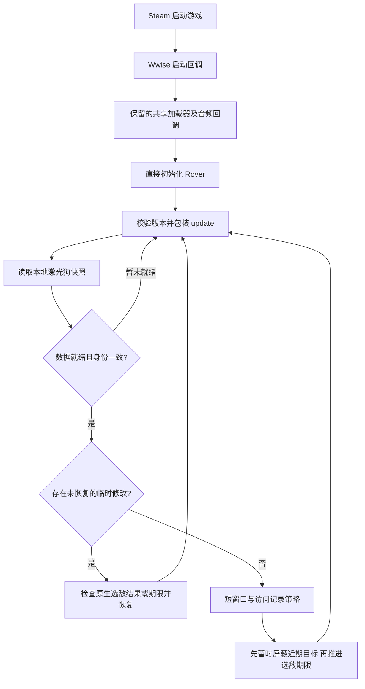

# 实现架构

## 行为目标和边界

0.3 保留激光漫游车原有 AI，只在短暂攻击后促使它重新选择目标。默认参考窗口为 0.4 秒；候选中优先保留尚未记录为近期攻击过的目标，否则保留最早记录的目标。没有其他可用目标时不干预。

不检测点燃、毒气、命中、血量或敌人死亡；也不把毒气狗的行为 ID 搬到激光狗上。毒气狗提供了“让更多敌人受持续效果影响”的行为参考，当前策略本身是时间窗口加访问记录。

## 模块与执行位置

| 文件 | 职责 |
| --- | --- |
| [`src/startup.lua`](../src/startup.lua) | 记录启动阶段，执行原共享加载器，再直接执行 Rover 编译入口 |
| [`src/install.lua`](../src/install.lua) | 每进程初始化保护、版本校验、包装 `update` / `shutdown`、运行日志和出错清理 |
| [`src/windows_api.lua`](../src/windows_api.lua) | Windows FFI：模块定位、哈希、读写当前进程、可写页检查和时钟 |
| [`src/snapshot.lua`](../src/snapshot.lua) | 找到本地玩家自己的激光狗，读取目标和候选，构造写入前/恢复时的身份校验 |
| [`src/policy.lua`](../src/policy.lua) | 纯策略：累积窗口、近期目标记录、允许/暂时屏蔽的目标集合 |
| [`src/lease.lua`](../src/lease.lua) | 记录原值，预校验、写入后核对、部分失败回滚和比较恢复 |
| [`src/controller.lua`](../src/controller.lua) | 将快照、策略、临时修改和恢复串起来，维护统计计数 |

安装后的 Lua 在游戏已有 Lua 环境中执行，通过 FFI 修改当前进程的数据。外部 `observe.py` 则运行在独立 Python/Lua 进程中，只读游戏；这两条路径不能混为一谈。

## 何时开始计时

策略要求同时满足：

1. 激光狗 `Behavior ID == 189`，当前节点为 `7`。
2. Behavior 目标非零，并与 Targeting 当前目标相同。
3. Behavior 的有效标记为 1，来源标志含 bit 0。
4. 有本地归属一致的快照。

节点 7 的原生逻辑包含攻击阶段的选敌操作，但这些条件**不证明激光此刻正在命中敌人**。转向、遮挡、射程、目标移动等仍由游戏处理。

每次换目标时清空已累计窗口；离开节点 7、目标不同步时也清空。采样间隔超过 0.25 秒或时钟倒退时，该段时间不计作攻击。控制器默认至少间隔 0.05 秒才读取一次，即最多约 20 Hz；实际频率受游戏更新调用影响。入口虽然在原 `update` 前后调用检查，也受这同一限频条件限制。

## 如何选择下一个目标

`snapshot.lua` 将原生候选视为可用，需要目标实体身份可解析、来源标志含 bit 0、阵营掩码与该无人机筛选条件相交、缓存的原生评分大于零。

`policy.lua` 从可用目标中排除当前目标。优先允许没有访问记录的候选；如果所有候选都有记录，允许访问序号最早的候选。其他近期候选及当前目标进入临时屏蔽集合。原生 AI 在允许的目标中继续按自己的评分决定选择谁，Mod 不直接指定下一个目标 ID。

一次请求成功提交后，把原目标记入历史并清空计时。注意记录的是**请求提交时的原目标**，不代表已命中、已点燃，甚至不代表该请求最终成功。历史以目标 ID 为键，以访问序号排序，不是按秒过期的冷却表。序号超过 4096 时压缩为仅保留当前记录；无人机身份键变化或快照不可用后也会重置策略状态。

因此 A/B/C 都可用时，访问记录会促使原生选择更广泛地轮换，而不是只在 A/B 间往返。目标短暂消失、ID 复用、评分变化等仍可能影响公平性；并没有“每只敌人严格轮到一次”的保证。

## 真正修改的字段

每次请求只触碰该无人机相关的现有可写数据：

| 字段 | 写入 | 目的 |
| --- | --- | --- |
| 本无人机感知候选记录 `+76`，4 字节 | 临时置零 | 使近期目标无法通过该次原生阵营资格判断 |
| Behavior runtime `+152`，8 字节 | 当前原生微秒时钟 | 推进下一次原生选敌期限 |

先处理候选掩码，最后处理期限。阵营修改发生在**该观察者的候选记录副本**上，不是修改敌人的全局阵营。不直接替换目标 ID、行为 ID、武器参数，也不调用原生选敌函数，不分配或修改可执行内存。

写入前检查完整快照身份、行为节点/目标、字段原值及内存属性。API 只允许已有 `MEM_COMMIT`、`MEM_PRIVATE`、`PAGE_READWRITE` 区域。期限比当前原生时间超前超过 1,000,000 微秒时停止处理，避免在不符合预期的布局或状态上继续请求。

## 临时修改怎样结束

出现以下任一情况时尝试恢复：目标变化、无人机身份变化、离开节点 7、快照不可用、选敌期限被引擎改写，或请求达到 0.25 秒期限。此期限由下一次 Lua 检查发现，游戏卡顿时不是严格的墙钟恢复上限。

`lease.lua` 按写入逆序恢复，先处理期限，再处理候选。身份仍匹配且字段仍是本 Mod 写入的值时才恢复原值；如果引擎已写入不同值，则保留引擎的结果。身份已经失效时放弃对旧地址恢复；读取暂时失败时返回未完成，让清理继续重试。部分写入失败会尝试识别属于本次写入的前缀并回滚，但这不构成原子事务。

取得修改资格时使用完整快照校验，恢复时使用更小的相关对象校验集合。这样更换武器、其他组候选数量变化不会让仍然有效的恢复被误判为失效，同时候选槽和目标实体身份变化仍可阻止旧值写入新对象。

恢复失败后入口停止新请求，后续 `update` 仍尝试 `control.stop()` 清理；日志中的停止原因不一定随着清理完成而自动改写。对象回收、线程间变化及“新值恰好等于 Mod 写入值”的情况不是比较恢复能完全证明排除的，仍需实机覆盖。

## 参数入口

| 参数 | 默认值 | 位置与含义 |
| --- | --- | --- |
| `window` | 0.4 秒 | `policy.lua`，攻击状态参考窗口 |
| `retry` | 0.15 秒 | `policy.lua`，请求提交后的最早再次请求间隔 |
| `max_gap` | 0.25 秒 | `policy.lua`，不连续采样的计时上限 |
| `lease_seconds` | 0.25 秒 | `policy.lua`，临时修改的检查期限 |
| 轮询间隔 | 0.05 秒 | `controller.lua` |
| 日志刷新间隔 | 2 秒 | `install.lua`，强制报告除外 |

这些都是源码参数；0.3 没有 INI、热重载或游戏内设置。修改后需要测试、重新打包并在游戏退出后部署。不要把减小窗口当成已验证的点燃优化。
