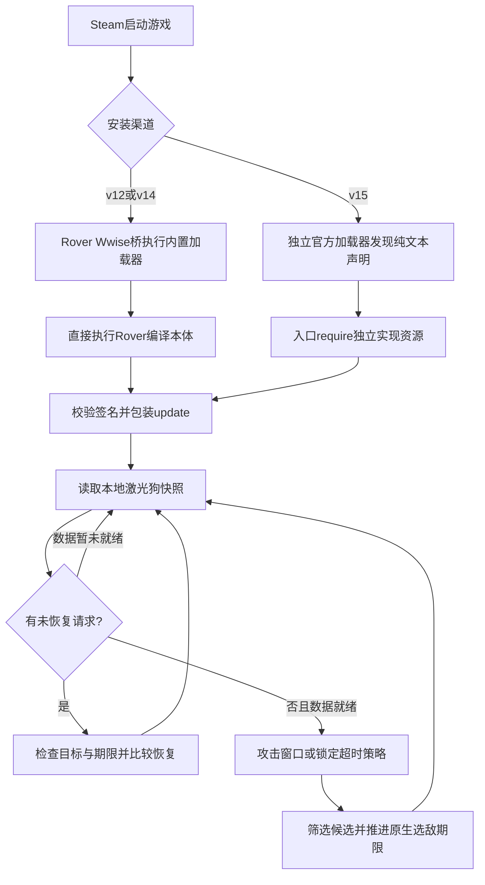

# 实现架构

当前实现0.7.4，更新于2026-09-19。0.7.3将未攻击重选窗口延长到1.5秒，0.7.4增加独立的1.5秒同目标占用兜底。索敌策略沿用0.7，HUD保留期沿用0.7.1；0.7.2新增No HUD及多渠道包装。

## 行为目标和边界

0.7保留激光漫游车原有AI，在约0.4秒同步攻击状态后促使它重新选敌；也处理同一目标连续1.5秒未进入同步攻击状态的锁定停滞。普通转火优先当前目标旁边的其他敌人，远目标转回漫游车15米内的候选优先；超时重选直接取距漫游车最近的其他有效目标。最多记录1个目标，1秒过期。没有其他可用目标时不干预。

不检测点燃、毒气、命中、血量或敌人死亡；也不把毒气狗的行为 ID 搬到激光狗上。毒气狗提供了“让更多敌人受持续效果影响”的行为参考，当前策略本身是时间窗口加访问记录。

## 模块与执行位置

| 文件 | 职责 |
| --- | --- |
| [`src/startup.lua`](../src/startup.lua) | v12/v14内置桥：记录阶段，执行对应官方加载器，再直接执行Rover编译入口 |
| [`src/addon_entry.lua`](../src/addon_entry.lua) | v15纯文本发现入口：校验加载器，再require独立编译实现 |
| [`src/install.lua`](../src/install.lua) | 每进程初始化保护、版本校验、包装 `update` / `shutdown`、运行日志和出错清理 |
| [`src/windows_api.lua`](../src/windows_api.lua) | Windows FFI：模块定位、哈希、读写当前进程、可写页检查和时钟 |
| [`src/position.lua`](../src/position.lua) | 根据unit generation及root pose布局只读无人机位置；失败时无法判断15米圈或距漫游车排序，但候选坐标足够时仍可按目标间距离选择 |
| [`src/snapshot.lua`](../src/snapshot.lua) | 找到本地玩家自己的激光狗，读取目标和候选，构造写入前/恢复时的身份校验 |
| [`src/policy.lua`](../src/policy.lua) | 纯策略：累积窗口、近期目标记录、允许/暂时屏蔽的目标集合 |
| [`src/lease.lua`](../src/lease.lua) | 记录原值，预校验、写入后核对、部分失败回滚和比较恢复 |
| [`src/controller.lua`](../src/controller.lua) | 将快照、策略、临时修改和恢复串起来，维护统计计数 |
| [`src/hud.lua`](../src/hud.lua) | 将当前干预与最近请求分别显示在自有屏幕GUI中；异常不影响索敌 |

安装后的 Lua 在游戏已有 Lua 环境中执行，通过 FFI 修改当前进程的数据。外部 `observe.py` 则运行在独立 Python/Lua 进程中，只读游戏；这两条路径不能混为一谈。

两个入口共用每进程Rover初始化guard。v15只改变加载方式，同一HUD变体的本体与v12/v14逐字节相同；不把加载器发布版本当作策略版本。具体覆盖关系见[多渠道说明](packaging-channels.md)。

## 何时开始计时

0.4.1启动时仍计算EXE和game.dll哈希，但哈希不同仅记录`compatibility=unverified_build_attempt`，不阻止初始化。代码签名不匹配、无法计算哈希、运行时结构断言或写入恢复异常仍会停止干预；这与暂时缺失数据后的自动重试不同。此放宽不改变任何偏移、选敌策略或可写范围。

正常短时攻击轮换要求同时满足：

1. 激光狗 `Behavior ID == 189`，当前节点为 `7`。
2. Behavior 目标非零，并与 Targeting 当前目标相同。
3. Behavior 的有效标记为 1，来源标志含 bit 0。
4. 有本地归属一致的快照。

节点 7 的原生逻辑包含攻击阶段的选敌操作，但这些条件**不证明激光此刻正在命中敌人**。转向、遮挡、射程、目标移动等仍由游戏处理。

每次换目标时清空已累计窗口；离开节点 7、目标不同步时也清空。采样间隔超过 0.25 秒或时钟倒退时，该段时间不计作攻击。控制器默认至少间隔 0.05 秒才读取一次，即最多约 20 Hz；实际频率受游戏更新调用影响。入口虽然在原 `update` 前后调用检查，也受这同一限频条件限制。

0.6的独立`idle_elapsed`仅在节点6/7、有非零目标且当前候选身份可核对、尚未达到节点7且synced的条件下累计。连续达到1.5秒请求`lock_timeout`重选；进入同步攻击、换目标或实体身份、离开节点6/7、快照缺失、长采样间隔或时钟倒退均重置。节点6的原生攻击条件通过后会进入7并请求开火，因此这是“未进入同步攻击状态”的近似判据；节点7同步但激光没实际射出或没命中不由该计时器识别，仍由普通约0.4秒转火处理。不能把它描述为激光命中检测。

0.7.4新增独立`lock_elapsed` / `max_lock_seconds=1.5`：同一非零目标、实体身份连续可确认且处于节点6/7时累计，攻击状态或synced短暂变化不会清零。在普通攻击窗口和未攻击窗口都未到期时，累计1.5秒产生`lock_max_duration`计划，按距漫游车最近的其他有效目标重选，忽略Recent。普通0.4秒攻击窗口仍优先；同帧已满足未攻击1.5秒则保留`lock_timeout`原因。

换目标/实体/无人机身份、当前目标身份缺失、离开节点6/7、快照缺失、超过0.25秒采样间隔或时钟倒退会清零。成功提交请求也清零，从后续首个有效观察重新计时，避免请求完成后立即重复提交；预校验失败不算成功提交。有且仅有一个有效目标时不强制切换，也不添加新的内存字段写入或原生调用。这是连续有效观察时间内的重选兜底，不保证游戏一定在1.5秒内完成物理转向。

已用原先每0.25秒切换状态的合成序列验证修复，仍需盾虫实战确认；见[调查记录](hive-guard-lock-investigation.md)。

## 如何选择下一个目标

`snapshot.lua` 将原生候选视为可用，需要目标实体身份可解析、来源标志含 bit 0、阵营掩码与该无人机筛选条件相交、缓存的原生评分大于零。

`policy.lua`从可用目标中排除当前目标。0.7的普通攻击轮换按以下顺序选择：

1. 当前目标距漫游车**大于15米**，且有其他有效候选距漫游车**小于等于15米**时，先将候选池限制到圈内。此规则先于Recent筛选，必要时允许重访近期目标。
2. 在所选候选池里先取没有近期记录的目标；如果全有记录，先取记录时间最早的目标。
3. 第1步触发时按距漫游车排序；否则按候选与本次即将离开的当前目标之间的三维直线距离排序。当前目标已经在15米内（含边界），或圈内没有可选目标时，均按相邻目标选，不强制下一个目标留在圈内。

这里的“上个目标”指本次转火前的当前锁定目标，而非Recent里的前一次目标或HUD保留的Next。位置使用本次候选快照，不缓存旧目标坐标跨局。当前目标身份/坐标不可用，或筛选后所有目标均无法计算目标间距离时，整池退回按距漫游车排序；不混用两种起点的距离比较。漫游车位置不可读但目标间坐标可用时仍可按相邻排序，只是无法判断15米优先条件。

同距离按较小目标ID稳定破除并列。重复候选ID沿用按最小有效漫游车距离选择代表条目的处理。其他有效候选及当前目标进入临时屏蔽集合，由原生选敌逻辑实际应用；不直接写目标ID。`lock_timeout`和`lock_max_duration`始终按距漫游车最近的其他候选选择，忽略Recent及相邻策略，保留解卡行为。

若候选池中没有任何可用距离，则允许该池里的目标继续由原生评分选择，日志为`native_distance_unavailable`；如果只有部分距离可读，则优先在可读者中选最近，不能据此声称它比未知距离的目标更近。距离来自缓存位置，不是寻路距离、目标表面距离或精确命中点距离。

0.6达到攻击窗口或锁定超时条件后记录当前目标，即使只有一个目标或后续写入预校验失败。历史以ID为键，值为`{identity=实体前20字节, at=最近合格观察时间, reason=attack_window、lock_timeout或lock_max_duration}`；Recent表示近期处理过，包括卡住后放弃的目标，不是已命中记录。选择下一目标时先使用旧记录，再替换成当前目标；否则只有1条时总是记录已被排除的当前目标，近期筛选将失去作用。提交请求重置攻击、未攻击和同目标占用三种计时及重试时间。

每次策略处理清理达到1秒的记录；新增不同目标直接替换旧项，表最多1项。实体ID复用但身份变更时删除旧记录。临时读失败或快照不一致保留未过期历史，但取消两种计时；无背包、离开任务或无人机身份变化则清空。清理随更新执行，不是独立定时线程；游戏暂停或更新停顿时不会在后台准时清理。

0.3的4096次整体重置、0.4的8项/4秒均为旧策略。1项和1秒限制近期记忆：过期或被替换的目标可再次参与优先选择。超时重选忽略Recent排序以优先找最近的其他有效目标，不扩展原生候选有效性。密集场景不保证远目标都能轮到，也不保证每次都能找到无障碍射线。

Recent可减少只在A/B间往返，但15米近处优先和超时解卡可重访Recent。目标间距离只是减少转向开销的近似，不等于最小转角或最短瞄准时间。距离布局的读取有独立身份/签名检查，失败只降级排序，不扩大任何游戏内存写入范围。

## 真正修改的字段

每次请求只触碰该无人机相关的现有可写数据：

| 字段 | 写入 | 目的 |
| --- | --- | --- |
| 本无人机感知候选记录 `+76`，4 字节 | 临时置零 | 使当前目标及未被本次策略允许的候选暂时无法通过原生阵营资格判断 |
| Behavior runtime `+152`，8 字节 | 当前原生微秒时钟 | 推进下一次原生选敌期限 |

先处理候选掩码，最后处理期限。阵营修改发生在**该观察者的候选记录副本**上，不是修改敌人的全局阵营。不直接替换目标 ID、行为 ID、武器参数，也不调用原生选敌函数，不分配或修改可执行内存。

写入前检查完整快照身份、行为节点/目标、字段原值及内存属性。API 只允许已有 `MEM_COMMIT`、`MEM_PRIVATE`、`PAGE_READWRITE` 区域。期限比当前原生时间超前超过 1,000,000 微秒时停止处理，避免在不符合预期的布局或状态上继续请求。

## 临时修改怎样结束

出现以下任一情况时尝试恢复：目标变化、无人机身份变化、离开发起请求时的节点（6或7）、快照不可用、选敌期限被引擎改写，或请求达到0.25秒期限。节点6请求期间进入7会立即尝试恢复。此期限由下一次Lua检查发现，游戏卡顿时不是严格的墙钟恢复上限。

`lease.lua` 按写入逆序恢复，先处理期限，再处理候选。身份仍匹配且字段仍是本 Mod 写入的值时才恢复原值；如果引擎已写入不同值，则保留引擎的结果。身份已经失效时放弃对旧地址恢复；读取暂时失败时返回未完成，让清理继续重试。部分写入失败会尝试识别属于本次写入的前缀并回滚，但这不构成原子事务。

取得修改资格时使用完整快照校验，恢复时使用更小的相关对象校验集合。这样更换武器、其他组候选数量变化不会让仍然有效的恢复被误判为失效，同时候选槽和目标实体身份变化仍可阻止旧值写入新对象。

恢复失败后入口停止新请求，后续 `update` 仍尝试 `control.stop()` 清理；日志中的停止原因不一定随着清理完成而自动改写。对象回收、线程间变化及“新值恰好等于 Mod 写入值”的情况不是比较恢复能完全证明排除的，仍需实机覆盖。

## 参数入口

| 参数 | 默认值 | 位置与含义 |
| --- | --- | --- |
| `window` | 0.4 秒 | `policy.lua`，攻击状态参考窗口 |
| `no_attack_seconds` | 1.5 秒 | `policy.lua`，同一目标未进入同步攻击状态的连续时间 |
| `max_lock_seconds` | 1.5 秒 | `policy.lua`，跨攻击状态切换保留的同目标有效观察时间；提交请求后重计 |
| `retry` | 0.15 秒 | `policy.lua`，请求提交后的最早再次请求间隔 |
| `max_gap` | 0.25 秒 | `policy.lua`，不连续采样的计时上限 |
| `lease_seconds` | 0.25 秒 | `policy.lua`，临时修改的检查期限 |
| `history_seconds` | 1 秒 | `policy.lua`，距最后合格观察的有效期 |
| `history_limit` | 1 项 | `policy.lua`，近期目标记录上限 |
| `near_radius` | 15 米 | `policy.lua`，远目标转回近处的半径；边界属于圈内 |
| 轮询间隔 | 0.05 秒 | `controller.lua` |
| 日志刷新间隔 | 2 秒 | `install.lua`，强制报告除外 |

这些都是源码参数；0.7.2没有INI、热重载或游戏内设置。修改半径时同步HUD短标签和打包元数据。修改后需要测试、重新打包并在游戏退出后部署。不要把攻击窗口或1秒记忆期限当成已验证的燃烧持续时间。

## 开销与界面隔离

快照最多读取3组各16条及3个特殊项，共51条候选；距离策略做数次线性扫描，不遍历全场所有敌人。每次快照内部read最多1800次，控制器最多约20Hz，Recent最多1条。该读预算不包含全部系统API开销，也不是实机帧耗时上界。

HUD最多10Hz，复用1个背景和5条文字。Next历史从请求提交起计2秒，绿/黄标题从恢复完成起额外计0.5秒；两者不延长lease。No HUD不编入hud.lua，控制器及文本日志一致。绘图Lua异常与控制器隔离，但不能据此排除原生渲染或驱动故障。

51候选的纯策略离线测量与GPU故障证据见[故障调查](crash-investigation-2026-09-19.md)，没有完整Mod实机性能或已确认崩溃修复的结论。
